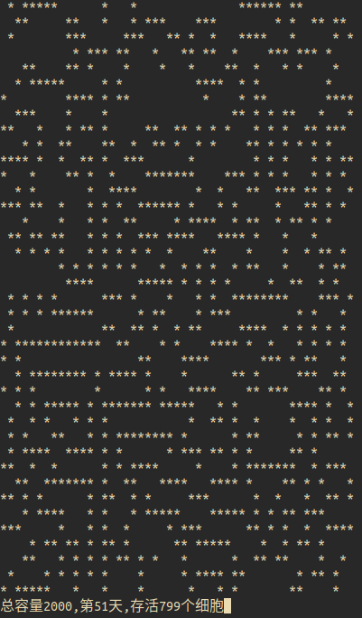

# game of life

1. package

```shell
$ mvn package -Dmaven.test.skip=true assembly:single
```

2. exec

```shell
$ cd target
$ java -jar game-of-life-1.0-SNAPSHOT-jar-with-dependencies.jar 40 50 0.5 500
```

* arg1: 容器行数
* arg2: 容器列数
* arg3: 初始化时是死亡状态的概率
* arg4: "每天"对应的现实时间

